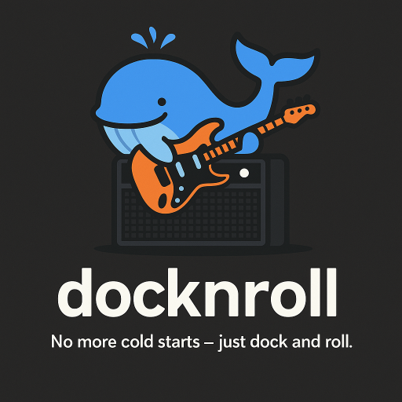

# docknroll

> No more cold starts — just dock and roll.

**docknroll** is a lightweight, macOS launcher script that kicks off your Docker-based Django dev environment with style. Built by and for Mac-based developers who want to spend less time clicking and more time coding.



---

## What It Does

- Starts Docker Desktop (and waits for it)
- Opens the Docker Dashboard
- Spins up your dev containers with `docker-compose`
- Launches your project in your chosen browser, along with useful web-based documentation and reference materials (with multiple tabs, if you want)
- Opens Terminal windows sized and colour-coded for your workflow
- Mounts network drives or opens code editors, if configured

All with **one double-click** or Automator trigger.

---

## Requirements

- macOS 
- [Docker Desktop](https://www.docker.com/products/docker-desktop/)
- Terminal or iTerm2
- Web browser
- Automator (for app-style launcher)

---

## Setup

1. **Clone the repo**
   ```bash
   git clone https://github.com/associativetrails/docknroll.git
   ```

2. **Copy the scripts you want**
   Add copies of `__launch.sh` and `__connect_to_live.sh` to your code directory


3. **Make the script executable**
   ```bash
   chmod +x __launch.sh
   chmod +x __connect_to_live.sh
   ```

3. **Customize your launch script**
   Edit `__launch.sh` and/or `__connect_to_live.sh` as a template to:
   - Start your containers
   - Open your preferred tabs
   - Open colour-coded Terminal windows
   - Connect to the live server
   - Mount SMB drives, etc.

4. **(Optional) Create a double-clickable app**
   - Open **Automator** → New **Application**
   - Add a **"Run Applescript"** block
   - Paste:
     ```applescript
     on run {input, parameters}
         tell application "Terminal"
            do script "/path/to/docknroll/__launch.sh; exit"
         end tell
         return input
      end run
     ```
   - Save it to your Desktop

---

## Why?

Because dev environments should **feel** fast and fun — not like cold-booting an aircraft carrier.

This started as a personal launcher for Django work on macOS, but it’s designed to be flexible enough for any Docker-powered stack.

---

## License

MIT. Use it, fork it, customize it.  
But if you make it better, consider sending a PR — we’ll docknroll together.

---

## Related

- [Docker Desktop for Mac](https://docs.docker.com/desktop/mac/install/)
- [Django](https://www.djangoproject.com/)
- [Automator](https://support.apple.com/guide/automator/welcome/mac)

